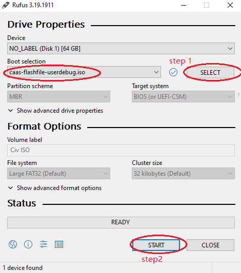
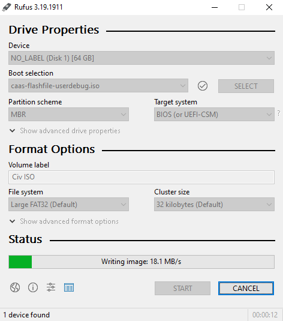
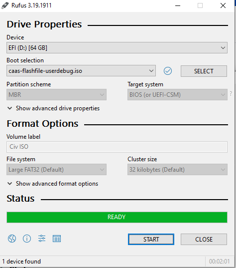
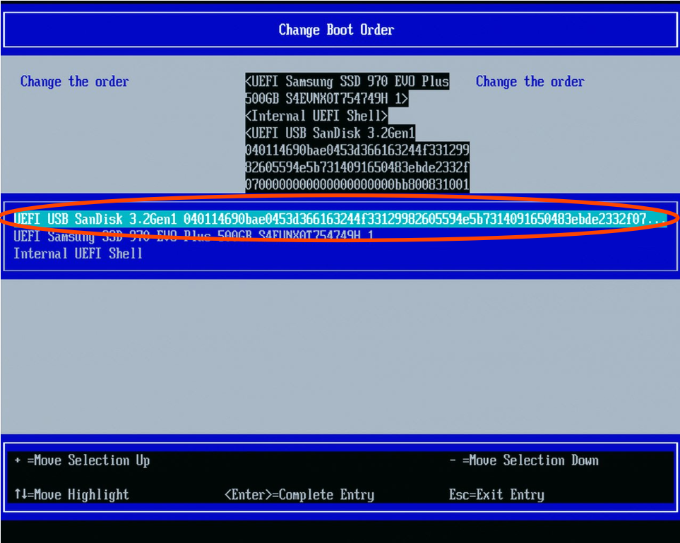
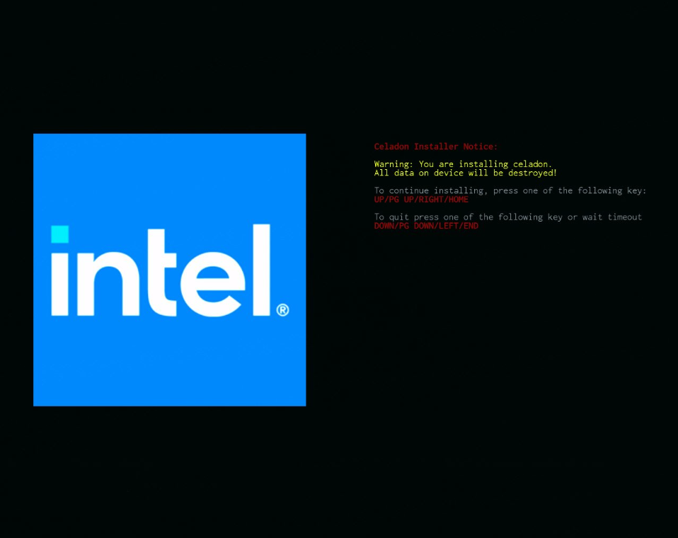
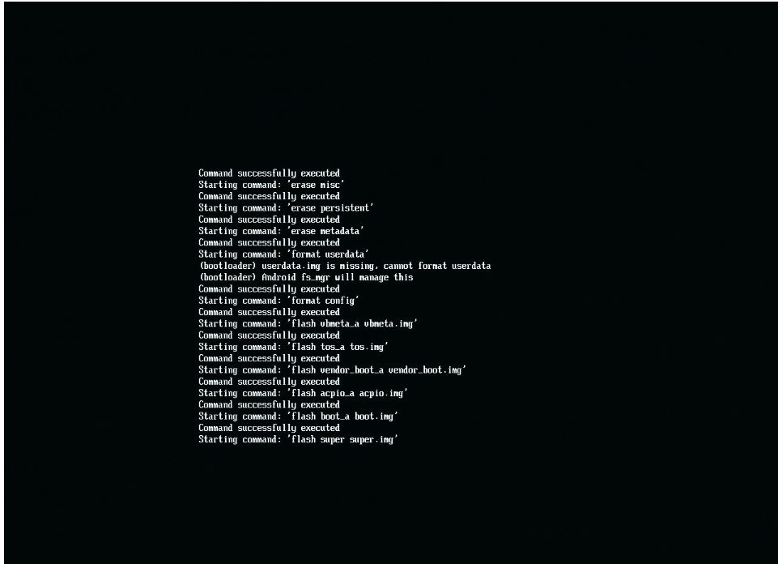
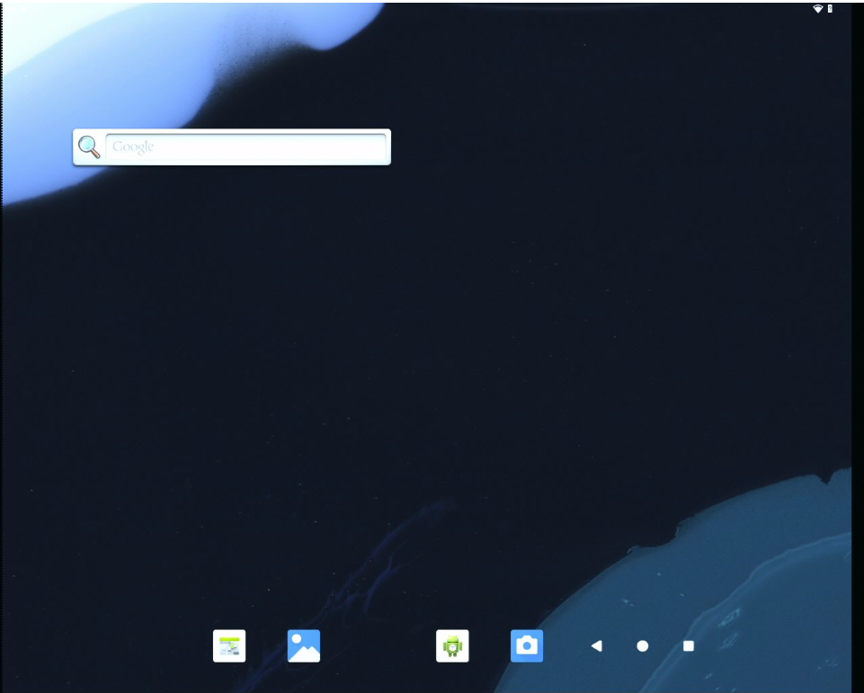

# Getting Started Guide
## Android* 16 Base BSP Reference Release for Intel® Edge Platforms (Intel® Core™ i5 processor 14500T)

Engineering Candidate 1 Release

February 2026

# Introduction

This document provides instructions for building and loading Android\*
16 on Intel® Core™ i5 processor 14500T for Edge Platforms.
    
> **Note:**
> This release is intended for testing and evaluation on the platform
only. It is not for production use.

You are recommended to review the release information before proceeding
with this Getting Started Guide. For release information, notes, and
references, refer to the following documents:

* Android* 16 Base BSP Reference Release for Intel® Edge Platforms (Intel® Core™ i5 processor 14500T) Release Notes (Published in [GitHub](https://github.com/edge-aosp-bsp/manifest/blob/master/README.md)) 

# Terminology

| Term            | Description                                                                 |
|-----------------|-----------------------------------------------------------------------------|
| adb             | Android Debug Bridge                                                         |
| AOSP            | Android Open-Source Project                                                  |
| BIOS            | Basic Input/Output System                                                    |
| BM              | BareMetal refers to an Android system that runs without a hypervisor.        |
| BSP             | Board Support Package                                                        |
| CRB             | Customer Reference Board                                                     |
| EC              | Engineering Candidate                                                        |
| GIT             | Git — Version control system                                                 |
| HDA             | High-Definition Audio                                                        |
| IFWI            | Intel Firmware Interface                                                     |
| ISO             | ISO image — Disk image format                                                |
| ISV             | Independent Software Vendor                                                  |
| LTS             | Long-Term Support                                                            |
| NIC             | Network Interface Card                                                       |
| NVME            | Non-Volatile Memory Express (NVMe)                                           |
| OS              | Operating System                                                             |
| PCH‑IO          | Platform Controller Hub — I/O Configuration                                  |
| Raptor Lake-S   | Intel® Core™ Processors (14th Gen) for Edge Platforms (Refresh)              |
| RDC             | Resource and Documentation Center                                            |
| RVP             | Reference Validation Platform                                                |
| SATA            | Serial ATA (Serial Advanced Technology Attachment)                           |
| SELinux         | Security-Enhanced Linux                                                      |
| TCC             | Intel® Time Coordinated Computing                                            |
| UEFI            | Unified Extensible Firmware Interface                                        |
| USB             | Universal Serial Bus                                                         |
| VMX             | Virtual Machine Extensions                                                   |
| VT-d            | Virtualization Technology for Directed I/O                                   |


## Intended Audience

This document is intended for OSVs/ISVs interested in using Android\* on
Intel® Core™ Processors (14th Gen) for Edge Platforms to enable their
customers.

## Customer Support

Contact your Intel representative for support or submit an issue to
[premiersupport.intel.com](http://premiersupport.intel.com/).

## Reference Documents

| Documentation on GitHub | Document No./Location |
|---------|------------------------|
| Android* 16 Base BSP Reference Release for Intel® Edge Platforms (Intel® Core™ i5 processor 14500T) Release Notes |  [GitHub](https://github.com/edge-aosp-bsp/manifest/blob/master/README.md) |
| Raptor Lake‑S Refresh Android Manifest File | [GitHub](https://github.com/edge-aosp-bsp/manifest/blob/master/stable-build/A16/BM_BSP_2026_Q1_v1_A16.xml) |


Log in to the Resource and Documentation Center
([rdc.intel.com](https://www.intel.com/content/www/us/en/resources-documentation/developer.html))
to search for and download the document numbers listed in the following
table. Contact your Intel field representative for access.

> **Note:**
> Third-party links are provided as a reference only. Intel does not control or audit third-party benchmark data or the websites referenced in this document. You should visit the referenced website and confirm whether the referenced data are accurate. 


| Documentation on Intel RDC | Document No./Location |
|---------|------------------------|
| 13th Gen Intel® Core™ Processors and Intel® Core™ Processors (14th Gen) (Code named Raptor Lake‑S/S Refresh) for Edge Platforms Reference UEFI BIOS/IFWI Version 6311_00 – IFWI Release Notes & Package |  [865275](https://www.intel.com/content/www/us/en/secure/content-details/865275/content-details.html) |


# Overview and Prerequisites

Android\* BSP is a reference implementation used for testing hardware
feature enablement. This document provides step-by-step instructions for
building the Android BareMetal image and installing it on the Intel®
Core™ Processors (14th Gen) platform.

## Requirement

### **Build Host Machine**
* A **64-bit development workstation** running the
Ubuntu\* 22.04 (Jammy Jellyfish) operating system.
* **Python version 3.6 or later**. This requirement aligns with the latest repo command
released by Google.
* At least **400GB of free disk space** on the
workstation is required to check out the source code and store build
artifacts.

### **Intel® Core™ Processors (14th Gen)** for Edge Platforms 
* Contains the latest supported **Intel® Core™ Processors (14th Gen) for Edge
Platforms** silicon.
* A minimum of **500 GB of storage**. 
* Flashed with the latest IFWI. Refer to the Intel® Core™ Processors (14th Gen) for
Edge Platforms Reference UEFI BIOS/IFWI ([Document Number:
865275](https://www.intel.com/content/www/us/en/secure/content-details/865275/content-details.html)) for the IFWI details.


* **High-speed network** connectivity

### Notes:

1. Although Android* is typically built using a GNU/Linux* or macOS* operating system, Intel recommends building the Android images on Ubuntu* 22.04. For setup instructions for other operating systems, refer to the [**“Establishing a Build Environment”**](https://source.android.com/docs/setup/start/requirements) section on the AOSP website.

2. Ensure that all Android build prerequisites are met before starting the build process.


## Set up the Build Environment

The Android source code consists of multiple Git\* repositories. The
repo tool makes it easy to work with those repositories. Refer to the
[Git Setup for Build
Environment](#git-setup-for-build-environment) if you need
to set up Git on your build machine.

1.  Create a local bin/ directory, download the repo tool to thatdirectory, and make the binary executable with the following commands:

```bash
mkdir -p ~/bin
curl https://storage.googleapis.com/git-repo-downloads/repo > ~/bin/repo
chmod a+x ~/bin/repo
export PATH=~/bin:$PATH
```

2.  Install the following required packages on your 64-bit Ubuntu 22.04 LTS development workstation before the compilation:
```bash
sudo apt-get update
sudo apt-get install -y wget openjdk-8-jdk git ccache automake \
   lzop bison gperf build-essential zip curl \
   zlib1g-dev g++-multilib python3-networkx \
   libxml2-utils bzip2 libbz2-dev libbz2-1.0 \
   libghc-bzlib-dev squashfs-tools pngcrush \
   schedtool dpkg-dev liblz4-tool make optipng maven \
   libssl-dev bc bsdmainutils gettext python3-mako \
   libelf-dev sbsigntool dosfstools mtools efitools \
   python3-pystache git-lfs python-is-python3 flex clang libncurses5 \
   fakeroot ncurses-dev xz-utils cryptsetup-bin \
   apt-transport-https ca-certificates curl lsb-release \
   rsync vim python-six kmod glslang-tools \
   software-properties-common cpio python3-pip ninja-build \
   cutils cmake pkg-config xorriso mtools libjson-c-dev file

sudo pip3 install meson==1.8.3 mako==1.1.0 dataclasses pycryptodome ply==3.11 

# OneAPI Integration support has been added
# but it has dependencies which need to be installed on the build environment

wget -O- https://apt.repos.intel.com/intel-gpg-keys/GPG-PUB-KEY-INTEL-SW-PRODUCTS.PUB  \
   | gpg --dearmor | sudo tee /usr/share/keyrings/oneapi-archive-keyring.gpg > /dev/null && \
   echo "deb [signed-by=/usr/share/keyrings/oneapi-archive-keyring.gpg] https://apt.repos.intel.com/oneapi all main" \
   | sudo tee /etc/apt/sources.list.d/oneAPI.list

sudo apt-get update 

sudo apt install -y \
  intel-oneapi-ipp-devel-2021.10 \
  intel-oneapi-mkl-devel-2021.1.1 \
  intel-oneapi-ipp-devel-32bit-2021.10 \
  intel-oneapi-mkl-devel-32bit-2021.1.1
```

> **Note:**
> If you encounter network connectivity issues, you can use the following commands
> to bypass Intel’s network proxy settings. To disable proxy settings:

```bash
unset no_proxy
unset NO_PROXY
export no_proxy=localhost
export NO_PROXY=localhost
In some cases, the system may use the system default no_proxy configuration. To override this behaviour, set a dummy no_proxy value.
After updating the no_proxy settings, run apt commands using the -E option:
sudo -E apt update
sudo -E apt install … 
```

## Download and Build the Source Code

This section outlines the procedures for downloading the Android source
code using the specified manifest and for building the Android BSP.

The manifest for this release, **BM_BSP_2026_Q1_v1_A16.xml,** is
available for download from
[GitHub](https://github.com/edge-aosp-bsp/manifest/blob/master/stable-build/A16/BM_BSP_2026_Q1_v1_A16.xml) directory.

1.  Download the manifest for this release: **BM_BSP_2026_Q1_v1_A16.xml**

```bash 
mv BM_BSP_2026_Q1_v1_A16.xml ~/.
```
2.  Create a working directory.
```bash 
mkdir ~/rpl-android-bm
cd ~/rpl-android-bm
```
3.  Download the source code from the manifest. For the latest on the branch:
```bash
# For the latest on the branch:
repo init -u https://github.com/edge-aosp-bsp/manifest.git  

# copy the manifest to .repo/manifests
mkdir .repo/manifests
cp ~/BM_BSP_2026_Q1_v1_A16.xml .repo/manifests/.

repo init -u https://github.com/edge-aosp-bsp/manifest.git -m BM_BSP_2026_Q1_v1_A16.xml

# Sync the repositories
repo sync -c --force-sync -j16
repo forall -c git lfs pull

```

> **Note:**
> The `repo sync` process may take an extended amount of time to complete.
> This behavior is expected and should not be interpreted as a system crash.
>
> You can use the `-j` flag to specify the number of parallel processes for
> `repo sync` to speed up the build. Adjust the value based on the number of
> available CPU cores, and remove the flag if you encounter issues. For example, `repo sync -c --force-sync -j16`

## Build Instructions

Build the image from the source code based on the instructions below.
```bash
# Prepare build environment
source build/envsetup.sh
# Build target can be caas-user or caas-userdebug
lunch caas-userdebug

# Start the build
make flashfiles BASE_LINUX_INTEL_LTS2024_KERNEL=true -j16

# build output
find out -name *.tar.gz
out/target/product/caas/caas-releasefile-userdebug.iso.tar.gz
out/target/product/caas/caas-releasefiles-userdebug.tar.gz

# Note:	The file is available in this path: 
# ~/rpl-android-bm/out/target/product/caas/
```

# Android\* Image Flashing and Boot up

This section describes the steps required to configure the BIOS and
prepare the USB drive for flashing the image to the board.

## BIOS Settings 

Users must verify that the setting is correct. These should be the
IFWI\'s default settings.

Press the hotkey (such as F2, DEL, or F12) during startup to access the
BIOS menu.

### BIOS Configuration

| Name                     | Menu                                                                 | Setting  |
|--------------------------|----------------------------------------------------------------------|----------|
| Intel (VMX) Virtualization | Intel Advanced Menu → CPU Configuration                              | Enabled  |
| VT-d                     | Intel Advanced Menu → System Agent (SA) Configuration                | Enabled  |
| Intel® TCC Mode          | Intel Advanced Menu → Intel® Time Coordinated Computing              | Disabled |
| #AC Split Lock           | Intel Advanced Menu → Intel® Time Coordinated Computing              | Disabled |
| OnBoard NIC              | Intel Advanced Menu → PCH‑IO configuration → EFI Network             | OnBoard NIC |


> **Note**
> The steps may vary depending on the BIOS.

## Flash Image to USB Drive

There are 2 steps to flash **caas-flashfile-\<\$variant\>.iso.zip** to
BM. 

### Step 1: Flash Image to the USB Drive

On a Windows\* machine, use the Rufus application or another tool to
create a bootable USB stick
from **caas-flashfile-\<\$variant\>.iso.zip** to USB drive. The Rufus app
can be downloaded from <https://rufus.ie/en/>

First, extract the caas-flashfile-\<\$variant\>.iso.zip file.

#### Select the ISO Image to Flash

<p align="center">
  
</p>

#### Example of Flashing in Progress

<p align="center">
  
</p>

#### Flashing Completed

<p align="center">
  
</p>

Alternatively, on Ubuntu, you can also use the dd command.

**[IMPORTANT NOTICE]** Replace the /dev/sdc below with the target USB device node name.

```bash
unzip caas-flashfile-userdebug.iso.zip
dd if=./caas-flashfile-userdebug.iso of=/dev/sdc bs=1024M  
#(takes 1-3 minutes depending on USB speed)

```

### Step 2: Flash to BM from USB Stick to Boot up the System to Android

1. Insert the USB drive into the board.
2. Press **F2** while booting the device.
3. Select the USB drive to boot as shown in below. Navigate to:  
   
   **Boot Maintenance → Boot Option Menu → Change Boot Order**
4. Set the USB drive as the first boot option. Save the changes (**Fn + F4**) and exit the BIOS (select **Continue**).

#### BIOS Settings to Change Boot Order



5. Press UP arrow, PG UP, RIGHT, or HOME to proceed with installation.

#### Installer Screen



6. This initiates the flashing. 

**Android Installation Progress**



7. Remove the USB drive and reboot. The device will finish flashing and
start Android.

#### Android Home Screen



> **Note:**
> You can select to use NVME or SATA as the storage.

## Git Setup for Build Environment
Git must be set up on your build machine to run repo init. Use the command below as a guideline:  

\# Setup git config with your name and email ID. Add proxy settings if behind a firewall  

cd /home/$USER  
vi /home/$USER/.gitconfig  

\# Append below lines to .gitconfig file  
```
[user]  
    email = <your email>  
    name = <your name>  
[http]  
    proxy = <http_proxy>  
[https]  
    proxy = <https_proxy>  
```
Create a symbolic link for Python 3 in the ‘/usr/bin’ directory.
sudo ln -sf /usr/bin/python3 /usr/bin/python


# Disclaimer

You may not use or facilitate the use of this document in connection
with any infringement or other legal analysis concerning Intel products
described herein. You agree to grant Intel a non-exclusive, royalty-free
license to any patent claim thereafter drafted which includes subject
matter disclosed herein.

No license (express or implied, by estoppel or otherwise) to any
intellectual property rights is granted by this document.

All information provided here is subject to change without notice.
Contact your Intel representative to obtain the latest Intel product
specifications and roadmaps.

The products described may contain design defects or errors known as
errata which may cause the product to deviate from published
specifications. Current characterized errata are available on request.

Copies of documents which have an order number and are referenced in
this document may be obtained by calling 1-800-548-4725 or visiting the
[Intel Resource and Documentation
Center](https://www.intel.com/content/www/us/en/resources-documentation/developer.html).

Intel technologies\' features and benefits depend on system
configuration and may require enabled hardware, software or service
activation. Performance varies depending on system configuration. No
product or component can be absolutely secure. Check with your system
manufacturer or retailer or learn more at
[intel.com](http://intel.com/).

The Bluetooth® word mark and logos are registered trademarks owned by
Bluetooth SIG, Inc. and any use of such marks by Intel Corporation is
under license.

© Intel Corporation. Intel, the Intel logo, and other Intel marks are
trademarks of Intel Corporation or its subsidiaries. Other names and
brands may be claimed as the property of others.


